# 3D LiDAR Object detection

In this subsection of the project [Sensor_fusion_and_Tracking](.) we developed an object detection based on a 3D point cloud from LiDAR. 

The object detections consist of 4 main steps:

1. Compute Lidar Point-Cloud from Range Image
2. Create Birds-Eye View from Lidar PCL
3. Model-based Object Detection in BEV Image
4. Performance Evaluation for Object Detection

## Compute Lidar Point-Cloud from Range Image

In this step, we mainly developed the extraction of range images from Waymo open-dataset since data comes as range images in this dataset. Then we converted the range images into point clouds. After doing these steps we build the following visualization functions:

* `show_range_image` function in [objdet_pcl.py](./student/objdet_pcl.py) file. This function allows us to visualize range images extracted from the waymo open-dataset.
* `show_pcl` function in [objdet_pcl.py](./student/objdet_pcl.py) file. This function allows us to visualize point clouds. This is particularly helpful to validate results and see particular features in the image.

### Results from `show_range_image` function

The following illustrations depict the range image extracted from the `segment-1005081002024129653_5313_150_5333_150_with_camera_labels.tfrecord` from waymo training open dataset.

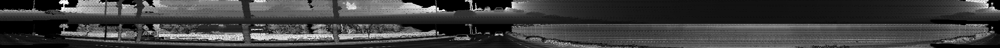
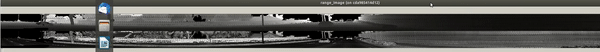

### Results from `show_pcl` function

The following illustrations depict the point cloud  extracted from the `segment-10963653239323173269_1924_000_1944_000_with_camera_labels.tfrecord` from waymo training open dataset after doing the conversion from range images to point cloud.

  

    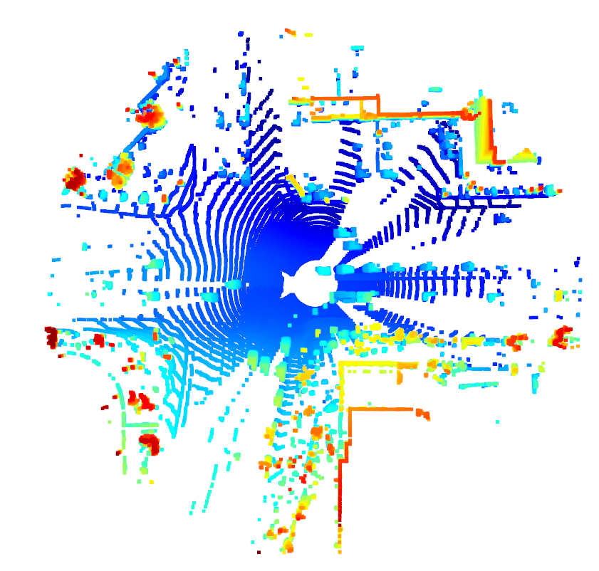
    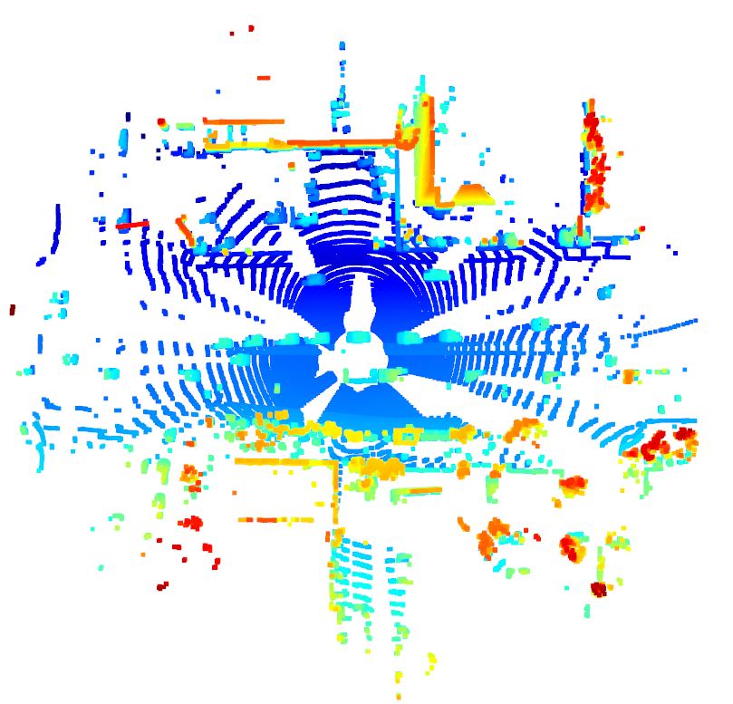
    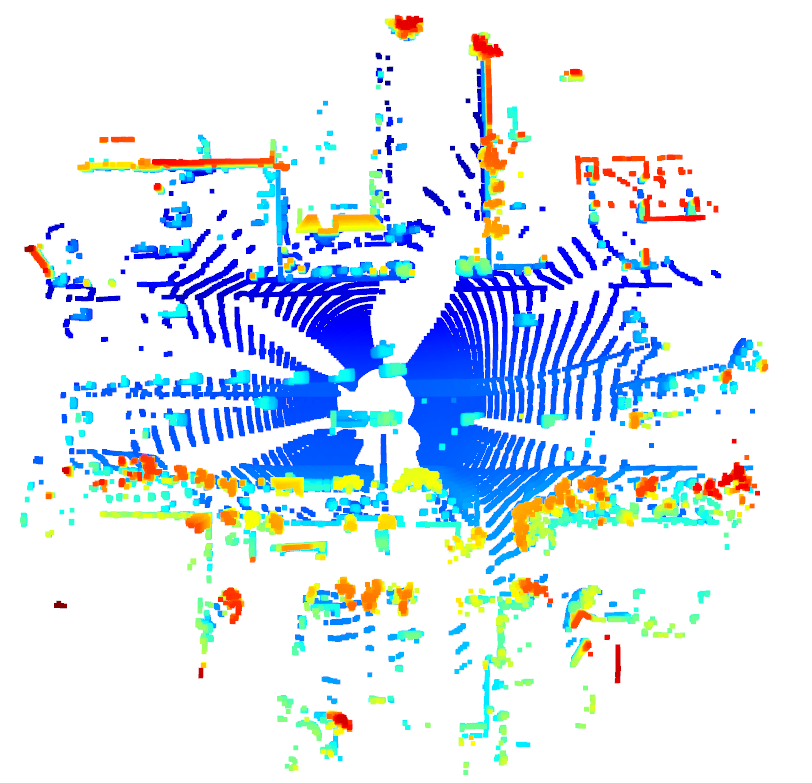
  

  

    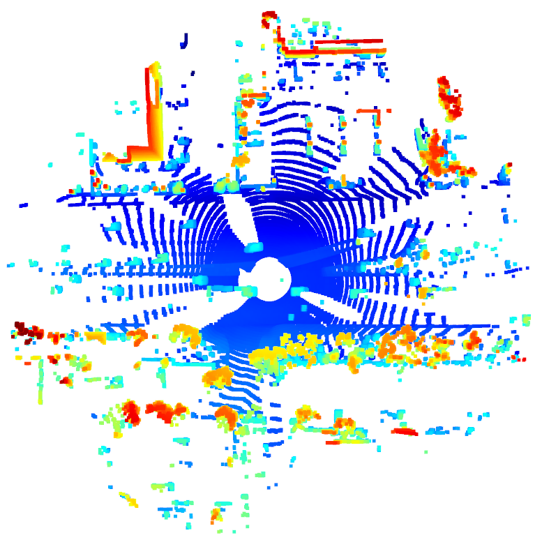
    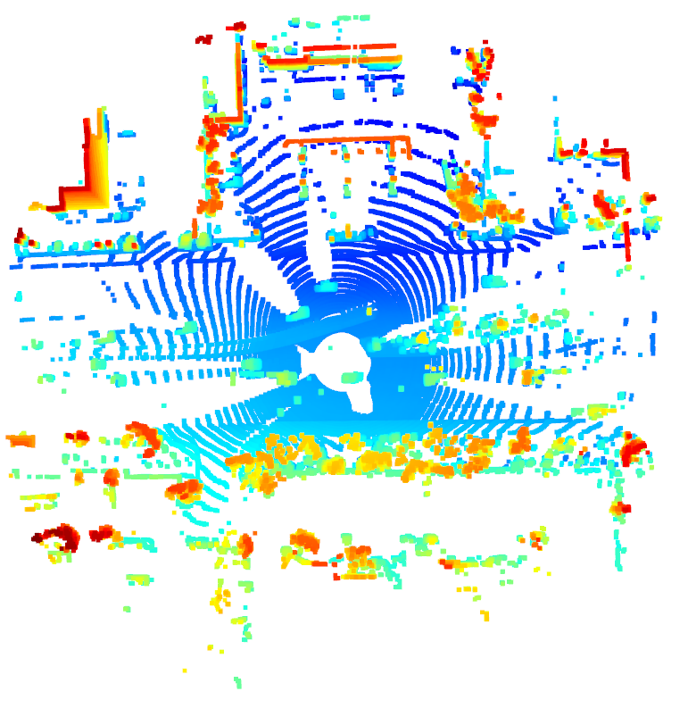
    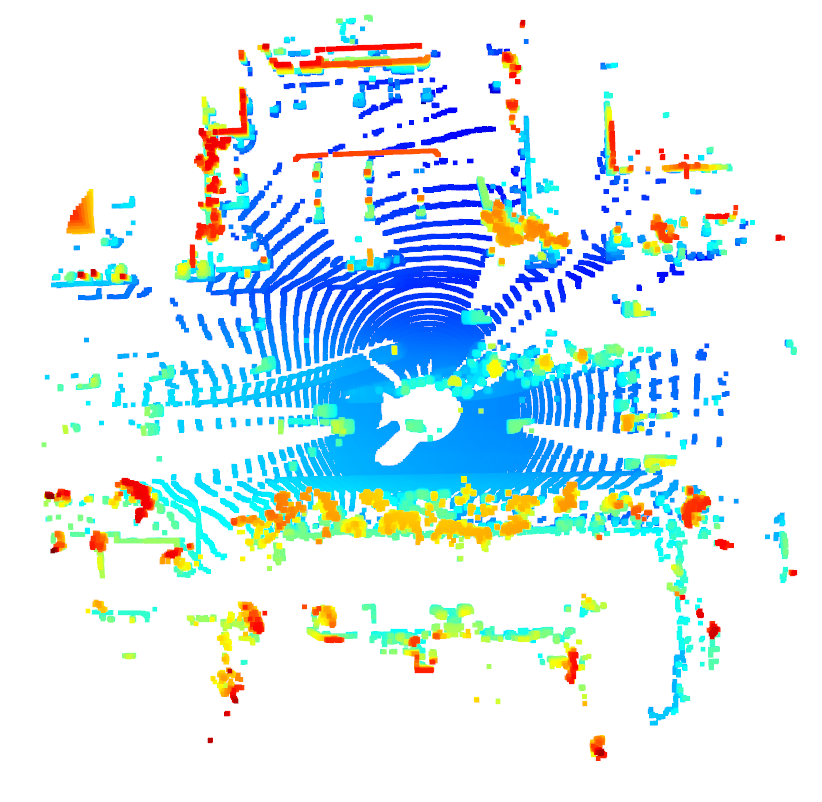
  

  

    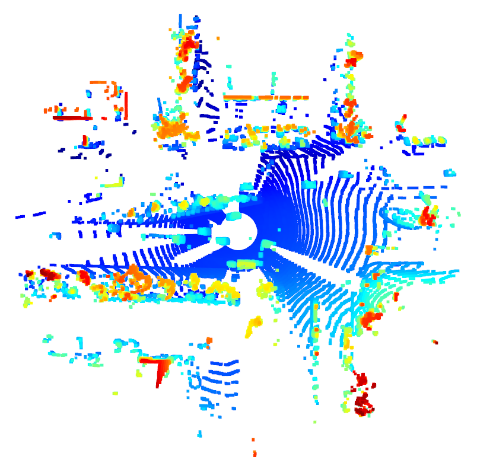
    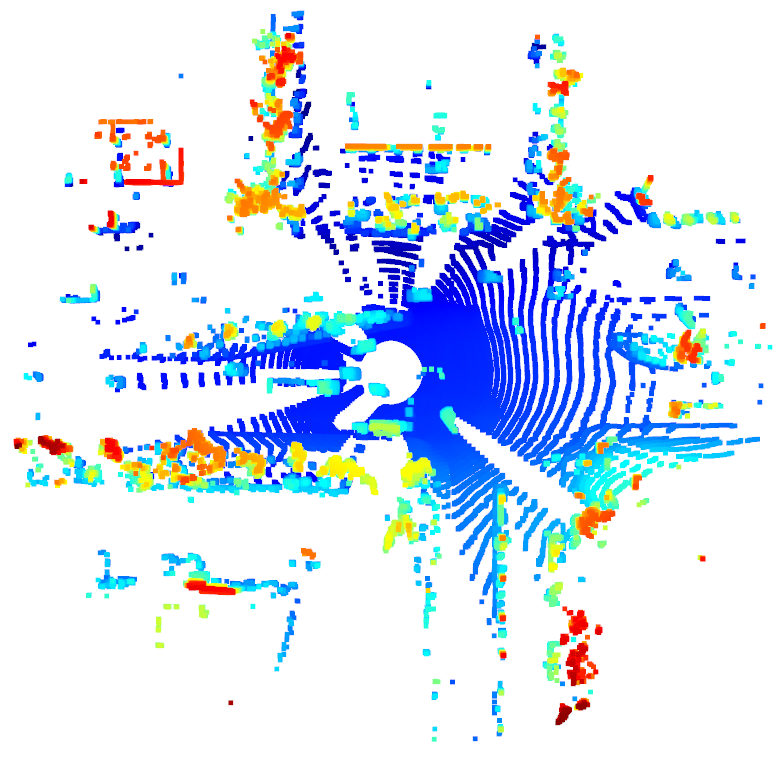
    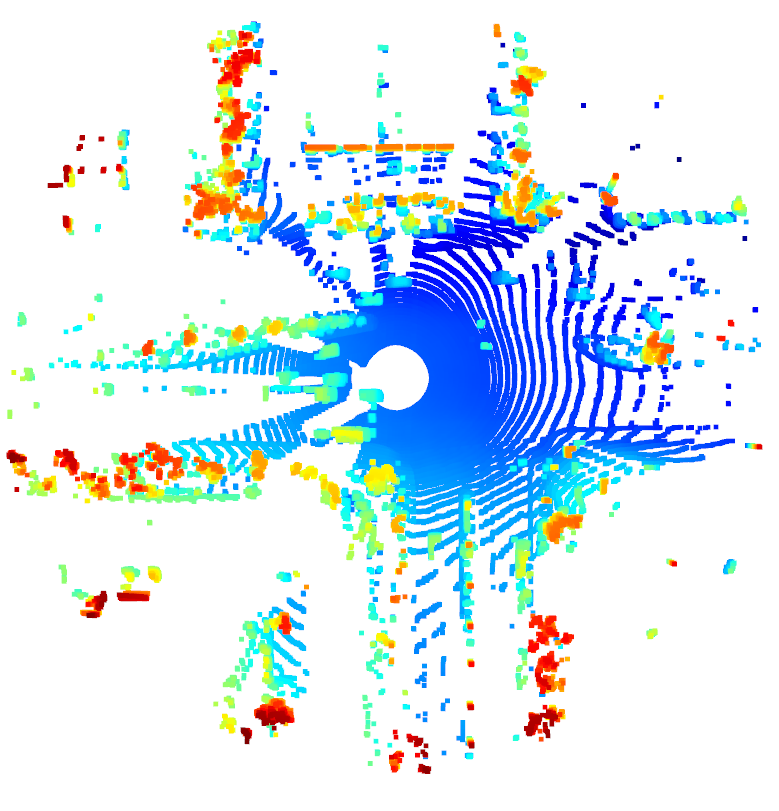
  

  

  
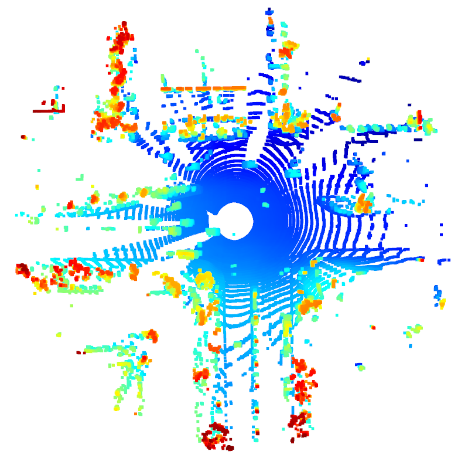

  

As we can appreciate from the above 10 images, there are particular features that vehicles have in point clouds. Some of them are the following:

* They have a box-like shape
* They are solid boxes
* They usually are incomplete boxes due to occlusion or the location of the LiDAR. This makes the visibility of cars variable, some parts that are appreciated on the point clouds are:

    * rear section of car, bumpers
    * lateral section
    * fron section of car, lights
    * sometimes general width or length of the car 

## Create Birds-Eye View from Lidar PCL

The whole implementation of this step can be found in the [objdet_pcl.py](./student/objdet_pcl.py) file inside `bev_from_pcl` function.

This step consisted of the following points:

* Convert sensor coordinates to Bird Eyes View (BEV-map) coordinates
* Compute intensity layer of the BEV map 
* Compute height layer of the BEV map 

To depict some results of this section, an illustration of frame 10 in the `segment-1005081002024129653_5313_150_5333_150_with_camera_labels.tfrecord` from waymo dataset is shown below:

  

    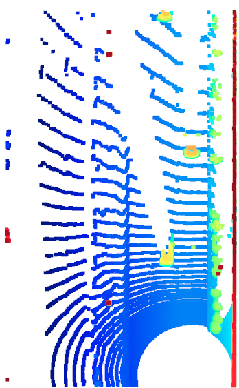
    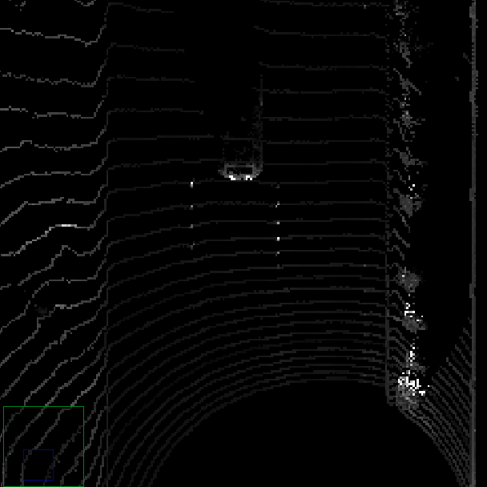
    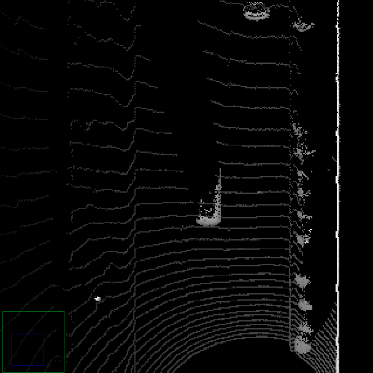
  

   
 (Left image)  BEV-map, (Center image)  Intensity layer from BEV-map, (Right image) Height layer from BEV-map  

## Model-based Object Detection in BEV Image

The implementation of this step can be found in the [objdet_detect.py](./student/objdet_detect.py) file.

This step comprises the following sections:

* Definition of the model. In this section, we defined two models that were already pretrained:
  * **Complex YOLOv4** (Darknet) that can be found [here](https://github.com/maudzung/Complex-YOLOv4-Pytorch)
  * **Feature pyramid network - Resnet 18 layers** (fpn-resnet-18) that can be found [here](https://github.com/maudzung/SFA3D)

* Inference, we pass the BEV-map computed on the previous section, to get some predictions in the form of boxes
* This boxes are then processed to be displayed on top of the BEV-map.

An illustration of the final results with the fpn-resnet-18 model is shown below:

>

An illustration of the final results with the complex-YOLO model is shown below:

>

## Performance Evaluation for Object Detection

After performing all the object detection successfully it is now time to assess the performance of our model. To achieve this an implementation of IOU, Precision and recall was done in the [objdet_eval.py](./student/objdet_eval.py) file.

The results for fpn_resnet are shown below:

  

    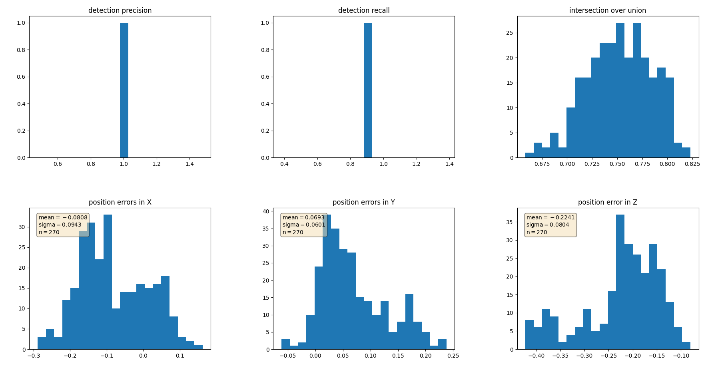
  

  

    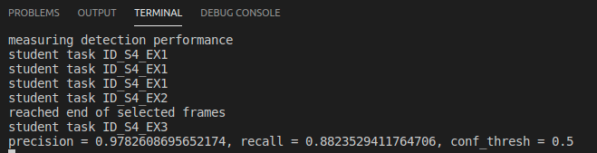
  
   

---

As you can see above the results are pretty good. Finally to do a sanity check of the impelemtation. The same metrics were computed for GT labels, as shown below:

  

    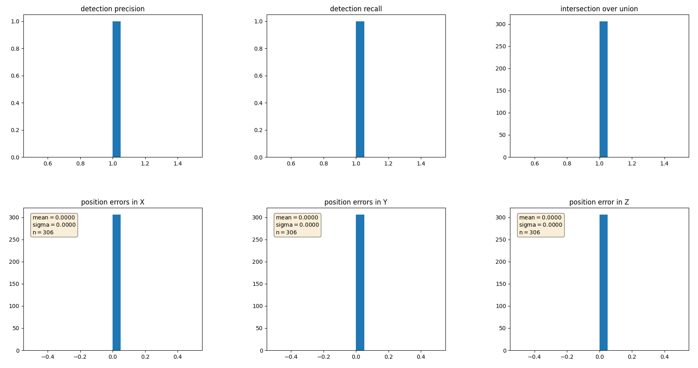
  

  

    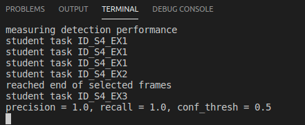
  
   

As expected the error are perfect since we are using GT data to compute the metrics. However, this way we confirm that our implementation of the metrics is correct. 