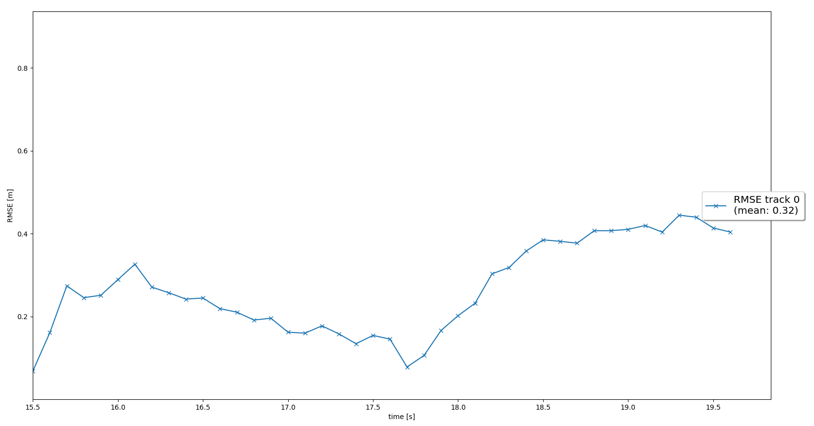
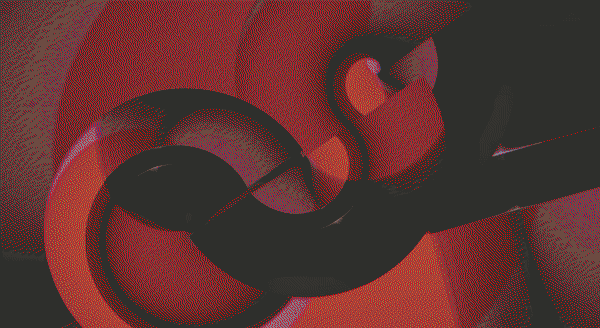
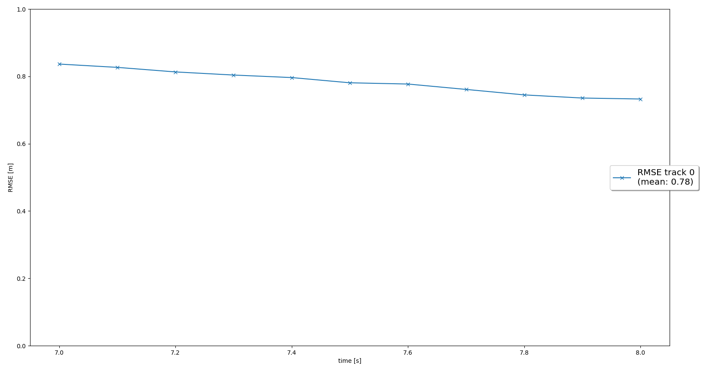
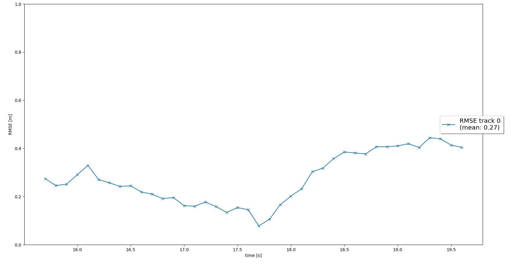
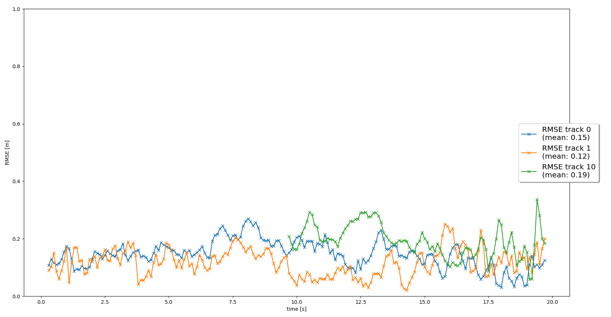
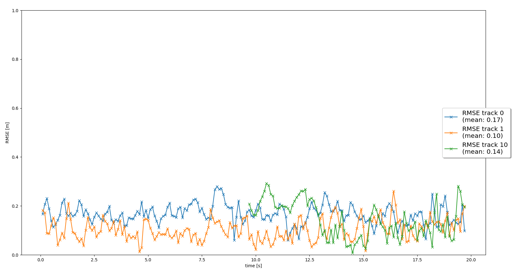

# Sensor Fusion and Tracking report

In this subsection of the project [Sensor_fusion_and_Tracking](./) we developed a sensor fusion tracking based on an Extended Kalman Filter. 

The Sensor Fusion development consisted of 4 main steps:

1. Tracking: Implementation of a Kalman Filter
2. Track Management
3. Data Association
4. Sensor Fusion

## Tracking: Implementation of a Kalman Filter

The heart of the project lies in this section because an EKF is developed for camera measurements, whereas a KF is implemented for Lidar measurements. The implementation of the filter is in the following archive [filter.py](./student/filter.py)

The model we used for prediction uses the basic equation of motion:

```
pos_x(t) = pos_x(t-1) + V *dt
```

This model assumes velocity is constant. Hence, we account for the variance this model could yield through the process/prediction noise embedded in the Q matrix of the Kalman filter. Since the estimation model is linear we don't require EKF linearization. The same thing happens with the measurement update from LiDAR. However, for the camera the model is not linear hence we must linearize it and consequently implement an EKF. 

In this section we perform a single tracking pipeline to assess the implementation of the EKF. The results at this stage of the project are shown below:

</center>
**Results:** The RMSE for the tracking maneuver is 0.32 which is inside the tolerance expected of 0.35
<center></center>


## Track Management

We can find the development of this section in the following file: [trackmanagement.py](./student/trackmanagement.py). In this section we did three main steps:

* **Define track scores** In this step we initialize track scores with a value based on the `window` parameter (number of frames for track score calculation). The equation we follow to define the score is the following:

```
score = # detection in last "window" frames / window
```

* **Define track states:** In this section we define 3 states based on their track scores:
  * *Initialized*: track score = 1/window
  * *Tentative*: track score between 1/window and 0.8 
  * *Confirmed*: track score higher than 0.8

* **Update track scores** and **delete tracks**: In this section we update scores by adding 1/windows whenever a track is found in a frame and decrease scores whenever they are not assigned to any. 

&nbsp;&nbsp;&nbsp;&nbsp;&nbsp;&nbsp;&nbsp;&nbsp;&nbsp;&nbsp;&nbsp;&nbsp;&nbsp;Once the score is too low or the covariance from px and py are higher than certain parameter we set as `max_P` we delete the track.

We tested the algorithm using a recording section where a vehicle appears in the range of the sensor and then vanishes. This was a good assessment as we can see how the algorithm sets the state of the tracking vehicle from initialized, tentative, confirmed, and finally deletes it. Please see the results below:

</center>
**Results:** The RMSE for the tracking maneuver is 0.78 which is inside the tolerance expected.
<center></center>

Finally, just for fun, I wanted to run the same test in the EKF section to compare the results before track management and after track management was implemented. The result was great as the MSE reduce from 0.32 to 0.27 as shown below:

<center></center>


## Data Association

The data association logic can be found in the following file: [association.py](./student/association.py)

 This section consisted of associating measurements from sensors to tracks. There are many algorithms that achieve this goal. However, for simplicity, we implemented one of the simplest techniques, the **Simple Nearest Neighbor (SNN)** data association.

 The SNN algorithm comprises the following main concepts:

 * **Mahalanobis distance:** This distance differs from a simple Euclidean distance or a Manhattan distance in that it also considers the tracks position uncertainty embedded in the covariance matrix S. The equation for the *Mahalanobis distance* is the following:

 ```
d(x,z) = gamma.T * inv(S) * gamma
 ```
 * **Association matrix:** This matrix (usually defined as **A**) registers the distance of all measurements (M) to all tracks (N). Thus, it is a N x M matrix. We look for the smallest entry in A in order to determine which track to update with which measurement, then we delete this row and column from A and the track ID and measurement ID from the lists. We repeat this until A is empty.

* **Gating:** This concept reduces the association complexity by removing unlikely association pairs. Because the residual is Gaussian, the Mahalanobis distance follows a Cumulative Distribution Function (CDF). A measurement lies inside a track's gate if the Mahalanobis distance is smaller than the threshold calculated from the inverse Cumulative Distribution Function (ICDF). To get the ICF we required a percentile and the Degree of Freedom (DOF). DOF equivalent to features-1 of the sensor. Hence, a `DOF = 2` for LiDAR (x,y,z) and `DOF = 1` for camera (x,y) was set. 

Once we finished the data association algorithm we could perform multiple tracking contrary to single tracking as we did in the previous sections. To assess this we select some frames where more than one vehicle passes through the field of view from the LiDAR. The results are shown below:

</center>
**Results:** The RMSE for all tracks is below 0.2 which is inside the tolerance expected.
<center></center>

**Note:** We can see how some ghost tracks appear during the recoding however they are deleted after some frames. 


## Sensor Fusion

This last section of the project lies in the following file: [measurements.py](./student/measurements.py)

The aim of this section is to include the camera measurements together with the LiDAR measurements that we were evaluating in all the previous sections. To achieve this we follow the below steps:

* Non-linear Camera measurement model *h(x)* and computed the jacobian *H* that linearizes the model using Taylor series expansion up to its 1st derivative. 
* Include the camera's covariance matrix *R*
* Defined a method to check if our sensor measurements are inside the field of view (FOV). This step is crucial to avoid decreasing the track score of metrics that are not detected by any of the sensors because of not being in their FOV.


We performed the same assessment as in the association section with multiple tracks, but with the difference that the trackings will be updated through the combination of camera and LiDAR this time. The results are the following:

</center>
**Results:** The RMSE for all tracks is below 0.2 which is inside the tolerance expected.
<center></center>

## Benefits of sensor fusion

The benefits of sensor fusion are:

* Increase of tracking accuracy 
* Higher certainty of measurements. 
* Fault tolerance and resilience. In case one of the sensors malfunctions the other ones can still provide good results thanks to the redundancy of measurements.
* In our project we did see an improvement in performance using sensor fusion as the track scores decrease in general. However, by fine-tuning the algorithm further we could get even better results.

## Challenges of sensor fusion in real-life scenarios

* The algorithm must track objects quickly enough to avoid any accident. Hence, approaches such as updating track scores based on a certain number of frames just delay the toolchain. We can see this problem in our implementation as some false positive tracks are removed after several frames which is not ideal. 
* As we noticed during the project, there are a lot of parameters we need to set and tune to get good results. In our project, the parameters we set are stored in the following file [params.py](./misc/params.py). This makes calibration time-consuming.

## Most difficult part of the project


Personally for me, the most difficult part was to develop the association of measurements and tracks since one little mistake can lead to the association of false-positive measurements to tracks instead of true-positive measurements. This occured to me and it was difficult to debug. 

## Conclusions

The performance of the sensor fusion in general decreased the RMSE of the tracking compared to relying only on one sensor after some fine-tunning. However, there is a lot more calibration we can do to get even better results. Finally the potential of the algorithm is very promising as can be seen in [this video](./documentation/sensor_fusion/sensor_fusion_video.mp4) recorded with the final algorithm. 

## Future work

Some of the tasks that come to my mind to enhance the performance of this project are the following:

* Replace SNN association with a more robust algorithm such as Global Nearest Neighbor (GNN) or Joint Probabilistic Data Association(JPDA)
* Use a better model for the prediction part of the EKF instead of the linear model we implemented in this project. A very popular model used in the ADAS and AD industry is the bicycle model which is a non-linear model.